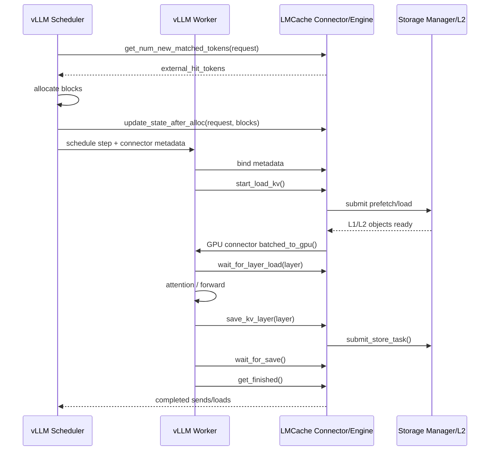
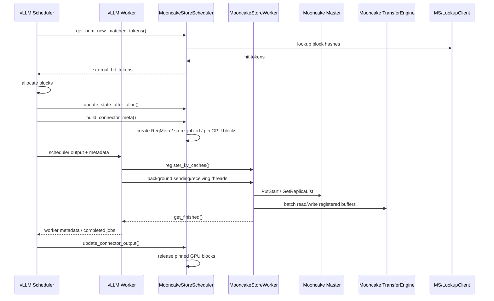
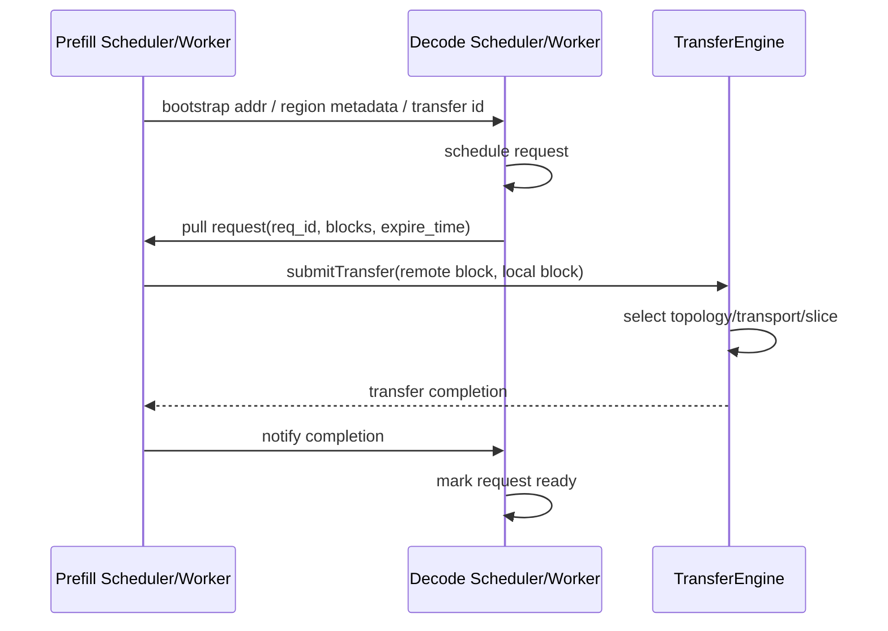
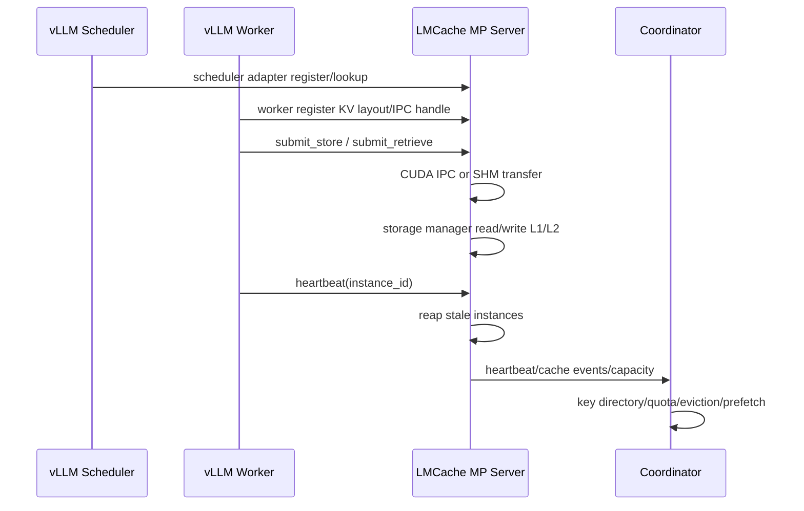

# 源码审计要点：关键协议与失败路径

本篇是全库证据密度最高的一篇：PD reservation、Store job ledger、TP/PP region 对齐、HCCS 通路、P2P 锁协议、Connector 状态语义，全部落到「文件:行号」粒度。

> 来源：V3 全文。行号基于 2026-08-28 快照，引用前请核对仓库版本。

# 源码审计：关键协议与失败路径

本文把前两份报告中的架构判断落到可复查的源码位置。路径相对本工作区根目录；行号基于 2026-08-28 快照。

## 1. LMCache async PD

### 1.1 关键类型

`LMCache/lmcache/v1/storage_backend/pd_backend_async.py`

| 行号 | 内容 | 含义 |
|---|---|---|
| 45 | `class PDMsgBase` | PD 控制消息基类 |
| 51 | `class AllocRequest` | sender 向 receiver 申请 staging |
| 68 | `total_chunks: int = 0` | 首个 batch 声明请求总 chunk |
| 71 | `class AllocResponse` | 返回远端 slot |
| 84 | `class ProxyNotif` | 全部 RDMA 完成后通知 proxy |
| 88 | `class CancelNotif` | abort 后释放远端 keys |

这四个消息构成 PD 的控制面协议。它不是把 vLLM request id 直接透传，而是显式表达 allocation、completion、cancel。

### 1.2 ReservationManager

| 行号 | 内容 | 判断 |
|---|---|---|
| 98 | `class ReservationManager` | receiver-only admission control |
| 102-104 | 注释解释 partial allocation deadlock | 设计动机明确 |
| 140 | `async_try_admit()` | 首批预留 total_chunks |
| 151-154 | available >= total_chunks 才成功 | 不允许部分 admission |
| 184 | `async_release_reservation()` | 完成或失败释放 |

关键点：sender 不使用逻辑 reservation，而是使用物理 staging buffer flow control。这与主报告第 4/7/9 章一致。

### 1.3 Sender staging flow control

| 行号 | 内容 | 判断 |
|---|---|---|
| 400 | `_staging_lock` | 保护 sender staging |
| 401 | `_staging_condition` | 物理空间等待队列 |
| 406 | `_req_total_chunks` | request -> declared total |
| 411-414 | buffer/chunk 大小 -> ReservationManager | receiver capacity 初始化 |
| 431-433 | `_req_allocated_keys` | 回滚所需 keys |
| 527 | `allocate()` | 单对象分配入口 |
| 566-588 | staging 满时等待 | RDMA 释放后唤醒 |
| 987 | `_notify_staging_freed()` | 唤醒等待者 |
| 1097 | `cancel_request()` | 请求取消入口 |
| 1114 | `_abort_request()` | 发送 CancelNotif |

### 1.4 Receiver admission 与回滚

| 行号 | 内容 | 判断 |
|---|---|---|
| 1212 | `_handle_alloc_request()` | AllocRequest/CancelNotif 分发 |
| 1284 | `_async_allocate_and_put()` | 实际分配与注册 |
| 1303-1306 | `total_chunks == 0` 抛错 | 不再支持 legacy sender |
| 1313-1325 | request chunks 超过 buffer capacity 报错 | fail-fast，避免必死请求进入 |
| 1334-1356 | cumulative chunks > declared total 抛错 | 协议违规检测 |
| 1340-1356 | rollback prior keys | 不留下部分请求状态 |
| 1422-1458 | 当前 batch 失败回滚当前/之前 keys | batch 失败不是只丢当前 batch |

这条路径说明 LMCache 已把“逻辑请求完整性”作为协议边界。没有 reservation 时，系统不是慢，而是可能死锁。

## 2. Mooncake Store vLLM worker

### 2.1 配置与分层

`vllm/vllm/distributed/kv_transfer/kv_connector/v1/mooncake/store/worker.py`

| 行号 | 内容 | 含义 |
|---|---|---|
| 75-77 | default global/local segment 4GiB | 嵌入模式默认池大小 |
| 123 | `MooncakeStoreConfig` | metadata/master/protocol/device/tenant |
| 135-139 | embedded vs standalone-store | 两种部署形态 |
| 241-243 | usable disk staging budget | SSD load 有 staging 上限 |
| 249-284 | split GET into sub-batches | 防止单批超过 owner staging |
| 294-370 | classify replica tier | memory/disk/unknown 分层观测 |

### 2.2 Store job ledger

| 行号 | 内容 | 判断 |
|---|---|---|
| 479 | `class KVCacheStoreSendingThread` | 后台写池线程 |
| 507-508 | group_put_steps | 只有相同 group bytes 的 rank 才可 stripe PUT |
| 512-518 | `stored_requests` 按 store_job_id 组织 | 避免 request id 复用导致 ledger 混乱 |
| 539-546 | add_request 断言 store_job_id 非空 | 写池必须有 job 身份 |
| 548-551 | `is_live_store_job()` | 判断 job 是否仍有效 |
| 562-581 | `finish_store_job()` | rank 完成计数 |
| 581-586 | `take_completed_saves()` | scheduler 释放 pinned blocks |

这解释了 2026-08-17 的 bugfix `dc9ae4b8ac`。问题不是简单的异步写，而是同一 request 在 preemption/恢复后可能产生不同 generation；只有 store job 是稳定生命周期单位。

### 2.3 Partial tail offload

| 行号 | 内容 | 含义 |
|---|---|---|
| 647 | `_maybe_offload_partial_tail()` | 处理未满块尾段 |
| 660-668 | no put or all success 才返回 True | 部分成功不能按成功处理 |
| 679-700 | group/block/put step/rank 选择 | hybrid group 的 rank 分工 |
| 771-806 | batch_put + metric + error | 部分尾块写失败有显式统计 |
| 858-859 | `_handle_request()` 分流 partial tail | 与正常 block PUT 分开 |

这说明 vLLM 的 CoW/partial block 与外部缓存 key 边界已经开始正面对抗。未来 HMA、Mamba、multimodal hash 会放大这个问题。

### 2.4 Load path

| 行号 | 内容 | 含义 |
|---|---|---|
| 1122 | `KVCacheStoreRecvingThread` | 后台读池线程 |
| 1213-1243 | staging budget 检查 | SSD load 不允许无限占用 buffer |
| 1268 | query replica tier | 观测 memory/disk |
| 1271 | `batch_get_into_multi_buffers()` | 多 buffer 批量读 |
| 1286-1316 | duration/error metrics | load 失败可观测 |

### 2.5 Worker 生命周期

| 行号 | 内容 | 含义 |
|---|---|---|
| 1330 | `class MooncakeStoreWorker` | worker 角色 |
| 1369-1378 | producer/consumer/capacity-only 判断 | consumer 可以只贡献容量 |
| 1543 | `_compute_group_tp_replication_factors()` | MLA/TP replication 特例 |
| 1622 | `register_kv_caches()` | 注册 paged KV |
| 1746-1750 | `start_load_kv()` no-op | load 在 get_finished 中发起 |
| 1753-1758 | `wait_for_save()` no-op | store 同样异步 |
| 1760-1815 | `get_finished()` 发起并收割 IO | compute overlap |
| 1852-1874 | close ended store requests | request 结束与 job ledger 解耦 |
| 1994-2014 | close store | 释放 TransferEngine/RDMA 注册 |

## 3. Mooncake direct PD connector

### 3.1 Region/TP/PP 对齐

`vllm/vllm/distributed/kv_transfer/kv_connector/v1/mooncake/mooncake_connector.py`

| 行号 | 内容 | 含义 |
|---|---|---|
| 89 | `TransferRegion` | layer/base/block length/group |
| 98-116 | `_get_tp_ratio()` | local/remote TP 比例，正负号表示方向 |
| 119-170 | `_expand_transfer_regions()` | 展开注册 KV tensor |
| 176-209 | `_compute_sender_transfer_plan()` | producer/consumer rank 映射 |
| 214-226 | `_can_coalesce_block_transfers()` | 连续 block 合并条件 |
| 229-279 | `_validate_asymmetric_region_lengths()` | region 数与长度校验 |
| 283-347 | `_align_transfer_regions()` | PP/重复 layer 按 occurrence 对齐 |

特别值得注意：PP 分片时 producer/consumer 的 layer 子集不同，直接按数组位置匹配会错。Mooncake 使用 `(layer_name, occurrence)` 作为 key，并检查 layer_index/group_index。

### 3.2 Pull/send 状态

| 行号 | 内容 | 含义 |
|---|---|---|
| 394-403 | `PullReqMeta` | transfer id、remote engine、expire time、pull count |
| 407-416 | `SendBlockMeta` | block ids、ready event、need/send/sending |
| 418-444 | `MooncakeConnectorMetadata` | reqs_to_recv/reqs_to_send |
| 447 | `MooncakeConnector` | direct PD connector |
| 595 | scheduler role | remote prefill/decode 参数处理 |
| 879 | worker role | bootstrap、sender executor、RDMA send |
| 1084-1110 | register worker with bootstrap | worker 交换地址 |
| 1175-1364 | send_kv_to_decode | handshake、region validate、TP pairing、执行发送 |

### 3.3 失败语义

direct PD 里的时间窗口包括：

1. P 侧调度完成但 D 尚未分配 block；  
2. D 发 pull 但 P 请求已过期；  
3. 一个 D 与多个 P 配对时部分完成；  
4. remote TP rank handshake 失败；  
5. region validation 失败；  
6. RDMA 发送成功但响应丢失。

Mooncake 用 `transfer_id`、`expire_time`、`pull_tasks_count`、`ready event`、`need_send/sending/sent` 状态和 ZMQ response 处理这些情况。它没有把传输简化成 fire-and-forget。

## 4. Mooncake HCCS/RDMA 通路源码证据

### 4.1 文档级证据

| 文件 | 行号 | 结论 |
|---|---:|---|
| `Mooncake/docs/source/design/transfer-engine/ascend_direct_transport.md` | 7 | ADXL 支持 H2D/D2H/D2D，协议包括 HCCS/RDMA |
| 同上 | 78 | HCCS 设备内存 2MB 对齐 |
| 同上 | 91 | A2/A3 默认 HCCS，`HCCL_INTRA_ROCE_ENABLE=1` 改 RDMA |
| `Mooncake/docs/source/design/transfer-engine/ascend_transport.md` | 130 | 自动判断跨 HCCS，选择 HCCS/ROCE |

### 4.2 实现级证据

| 文件 | 行号 | 结论 |
|---|---:|---|
| `mooncake-transfer-engine/src/transport/ascend_transport/hccl_transport/ascend_transport_c/hccl_transport_mem_c.cpp` | 548-558 | A2 8 卡同 host/group 判定是否跨 HCCS |
| 同上 | 863-947 | socket 选择 vNIC/NIC，并记录 cross-HCCS |
| 同上 | 1070-1105 | same-HCCS 需要 HcclMemGrant |
| `mooncake-transfer-engine/src/topology.cpp` | 230-248 | 读取 IB 设备 PCI bus/NUMA |
| 同上 | 415-448 | CPU topology 选择同 NUMA HCA |
| 同上 | 494-534 | PCI distance/NUMA 比较 |
| 同上 | 535-593 | CUDA topology：同 NUMA优先，PCI distance 排序 |

这说明 HCCS/RDMA/NVLink 不是口号，而是进入 transport selection 与地址/设备注册的实现。

## 5. LMCache P2P 锁协议

`LMCache/lmcache/v1/distributed/l2_adapters/p2p_l2_adapter.py`

| 行号 | 内容 | 判断 |
|---|---:|---|
| 46 | lookup RPC timeout 3s | 控制面快速失败 |
| 128 | `class P2PL2Adapter` | 单 peer 只读 L2 |
| 186 | `submit_store_task()` | store 记录 0-byte success，释放锁 |
| 213 | `submit_lookup_and_lock_task()` | lookup-and-lock 控制面 |
| 251 | query lookup result | pending/ready/two-state |
| 284 | `submit_unlock()` | fire-and-forget |
| 299 | `submit_load_task()` | local address + remote address -> transfer read |
| 322 | `get_transfer_channel_address()` | 本地 L1 offset/size 转换 |
| 369-378 | close | 注销 notifier、移除 client、关闭 eventfd |

`LMCache/docs/design/v1/distributed/l2_adapters/p2p_l2_adapter.md` 进一步说明 store 路径故意不做远程写，防止失败后破坏双方。

## 6. vLLM KV Connector 状态语义

`vllm/vllm/distributed/kv_transfer/kv_connector/v1/base.py`

| 行号 | 内容 | 含义 |
|---|---:|---|
| 24-47 | scheduler/worker method summary | 接口契约 |
| 75-91 | `CopyBlocksOp` | host transfer 支持 h2d/d2h |
| 101-124 | `SupportsHMA` | hybrid memory allocator 能力 |
| 150-162 | `requires_kv_delivery` | producer 默认要求可靠 delivery |
| 154-166 | preemption recompute 语义 | 防止 KV 来源 block 已被释放 |

这些接口已经不只是“搬 KV”，而是把外部系统纳入 vLLM 的 block 生命周期协议。

## 7. 可复查疑点

### 7.1 LMCache

1. `_async_allocate_and_put()` 在 protocol violation 时先 rollback 再抛错；如果 rollback 中单个 remove 失败，是否仍然保留 reservation？代码有 warning，但需要测试。  
2. sender `cancel_request()` 先 notify staging，再把 abort schedule 到 sender loop；极端情况下 abort 消息是否可能晚于新 alloc？  
3. `ProxyNotif` 要求 completed chunks 与 last batch 都完成；如果最后一 batch 失败，是否总是进入 `_abort_request()`？  
4. partial tail offload 与 Mooncake L2 adapter 组合时，L2 adapter 是否继承同样的 group/offset 语义？

### 7.2 Mooncake

1. `KVCacheStoreSendingThread.finish_store_job()` 记录 rank 完成次数；如果某 rank 的线程异常退出，scheduler 的 pinned blocks 是否最终会被 watchdog 释放？  
2. partial tail put 部分失败后，下一次重试是否可能与新的 store job 交错？  
3. direct PD handshake 成功后，D 侧 request 被取消，P 侧 `sending` 计数如何收敛？  
4. TENT submit-stage partial enqueue 未自动 failover，上层是否有足够的 task id 信息做安全清理？  
5. HCCS 2MB 对齐是否要求 vLLM paged block layout/注册方式做特殊打包？

### 7.3 vLLM

1. `requires_kv_delivery` 默认 producer True，但对 best-effort cache 可能过于保守；connector 是否总是正确覆写？  
2. `get_finished()` 同时收割 load/save，是否可能把 save 完成误用于 load readiness？每个 connector 需要明确拆分。  
3. MultiConnector 的 hit selection 是否有统一 cost model，还是仍由各 connector 独立决定？

## 8. V3 修订结论

1. LMCache async PD 的 reservation 不是文档装饰，而是消息协议、等待条件、回滚和协议校验共同支撑的核心状态机。  
2. Mooncake Store vLLM worker 的 `store_job_id` 是正确设计：request id 不是异步写池的稳定生命周期单位。  
3. Mooncake direct PD 的复杂度主要来自 TP/PP region 映射，而不是 RDMA API 本身。  
4. Mooncake 的 HCCS/NVLink/RDMA 证据同时存在于文档和 transport/topology 实现。  
5. vLLM KV Connector V1 已经把 block 生命周期、可靠 delivery 和 HMA 纳入接口；第三方 connector 的实现成本会继续上升。


---

## 附：版本考古（V2）

### 1.1 LMCache async PD backend

LMCache 中 `ReservationManager` 相关的历史可以追溯到 commit：

```text
588ee83c feat(pd_backend): fully async PD backend (#3038)
2026-05-11
```

这个提交规模很大，新增：

- `lmcache/v1/storage_backend/pd_backend_async.py` 约 1663 行；
- `tests/v1/storage_backend/test_pd_backend_async.py` 约 1081 行；
- `docs/design/v1/pd_async_reservation_design.md`；
- 1P1D/xPyD 配置；
- cache engine/config/storage backend 接入。

工程含义：

1. LMCache 的 async PD 不是简单把 NIXL send/recv 包一层，而是为 chunked prefill 引入了完整协议；  
2. 测试代码量接近实现代码量，说明作者把 admission/failure/abort 当成核心语义；  
3. 该设计从一开始就承认 receiver staging capacity 是全局资源，而不是 per-request 局部资源。

### 1.2 Mooncake vLLM Store 的 block pinning

vLLM 主干有两个关键提交：

```text
dc9ae4b8ac [Bugfix][Mooncake] Reference GPU blocks for in-flight store jobs
           and key the store ledger by store_job_id (#52372)
2026-08-17

bf2866f8bf [KV Connector] Add decode offloading to Mooncake Store consumers (#52466)
2026-08-20
```

第一个提交非常重要：它把 store ledger 从 request id 改成 `store_job_id`，并对 in-flight store job 持有 GPU block 引用。request id 可能因 preemption/重试/恢复复用，而 store job 是一次性写池动作，用 job id 更符合生命周期。

第二个提交把 decode offloading 加给 Mooncake Store consumer，扩展了 consumer 也能写池的场景。这解释了 `save_decode_cache` 的价值：agent 会话中 decode 产生的增量上下文也可能成为后续 prefix。

### 1.3 Mooncake TENT rail failover

TENT 的 rail failover 不是一次设计完成，近期仍有连续修复：

```text
5ef889dd [TENT] Recover cooled-down RDMA rails and add failover e2e tests (#1984)
2026-04-30

43cbd9f6 [TENT] RDMA: skip NICs that cannot GPUDirect-DMA to a GPU,
           and fix fallback device rotation (#3281)
2026-08-06

09dfb006 [Bugfix][TENT] Fix RailMonitor topology use-after-free (#3598)
2026-08-25
```

这说明：

1. multi-NIC/RDMA 数据面的工程难点在长期运行中不断暴露；  
2. “能连上 RDMA”和“该 GPU 能通过该 NIC 做 GPUDirect DMA”不是同一件事；  
3. topology lifetime 也是故障源，RailMonitor 需要与 Topology 生命周期绑定。

这些历史证据支持主报告的判断：Mooncake 的核心优势是持续经营物理拓扑数据面，但这也是复杂度和 bug 面所在。

---

## 附：关键调用时序（V2）

### 2.1 LMCache vLLM in-process load/save



关键不变量：

1. lookup 可多次发生，但不应该有副作用；  
2. 只有 vLLM 分配 block 后，数据面才知道目标 GPU buffer；  
3. layerwise load 的完成粒度低于整层 forward；  
4. save 的完成必须晚于 GPU buffer 可能被复用。

### 2.2 Mooncake Store vLLM load/save



关键不变量：

1. Mooncake Store 的 worker 不做 layerwise hook，而是在 step 后异步批量处理；  
2. `store_job_id` 是保存动作的 ledger key；  
3. GPU block 释放要等所有 rank 完成同一个 store job；  
4. Mooncake Master 只发对象/replica metadata，数据走 TransferEngine。

### 2.3 Mooncake direct PD



直接 PD 的难点不在 RDMA API，而在两边 scheduler 可能乱序、TP/PP 不同、请求可能取消。Mooncake connector 用 transfer id、expire time、block plan 和状态机处理这些边界。

### 2.4 LMCache MP mode



MP 模式的重点是把 request protocol、device handle protocol、worker liveness protocol 分开。很多事故不是 cache miss，而是 IPC handle 绑错、worker PID 复用、server 重启后目录过期。

> **表述精度说明（源码复核）**：LMCache 的「REQ socket 超时 5 秒后关闭重建」行为专指 `pd_backend.py:749-759` 的 cache-query socket（`poll(timeout=5000)`，超时后 `close()` + 下次调用重建）；通用 RPC 层（`rpc_utils.py`）默认超时为 30s（recv）/10s（send）。引用时不应泛化为「LMCache 所有 ZMQ 超时均为 5 秒」。
